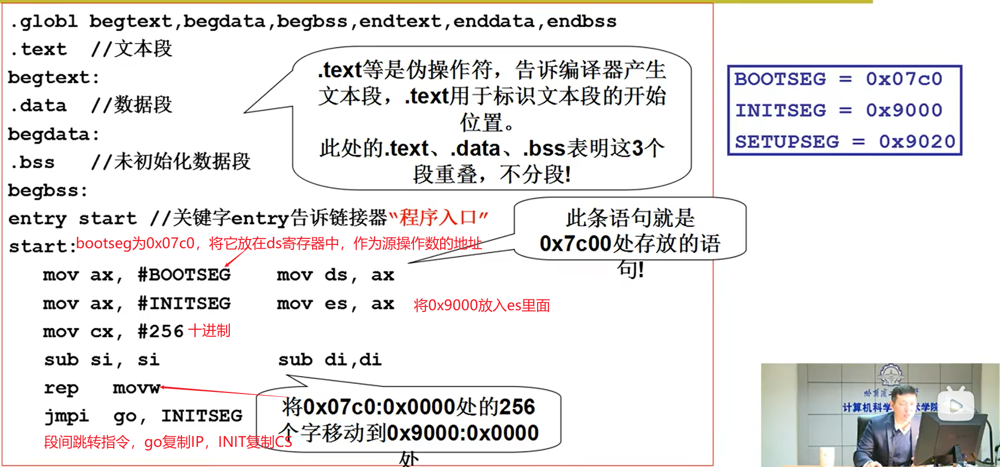
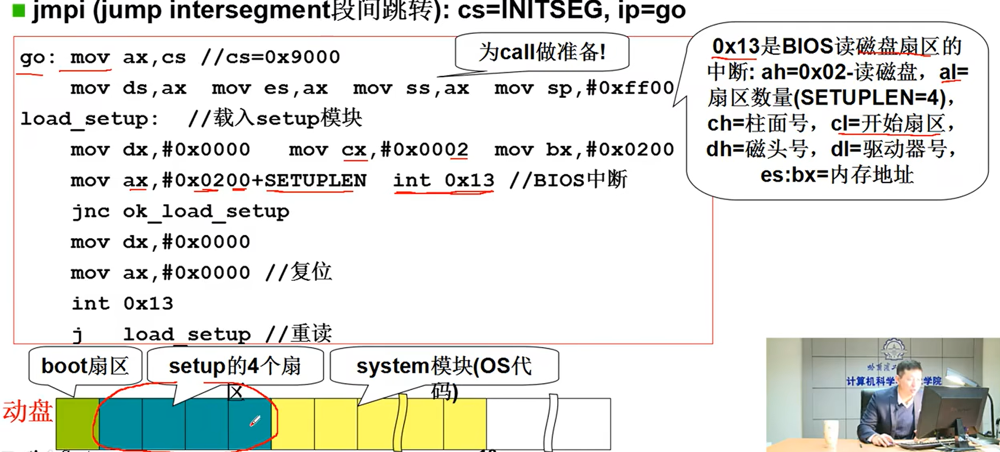
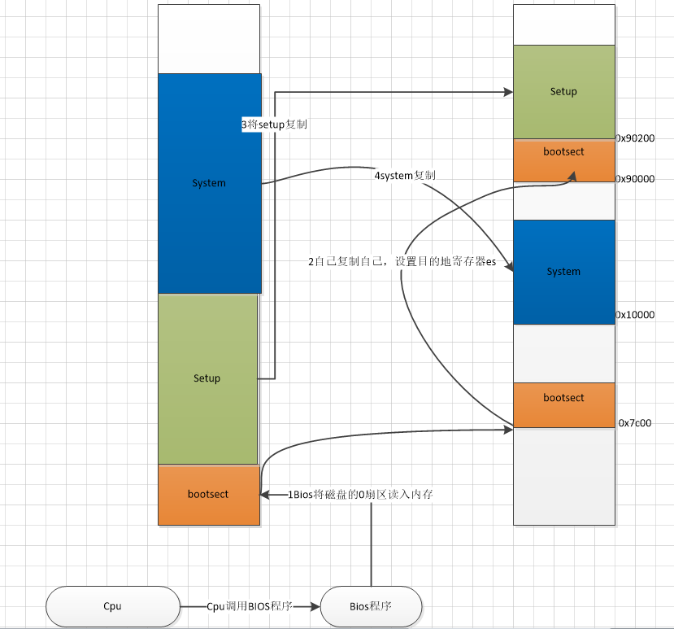
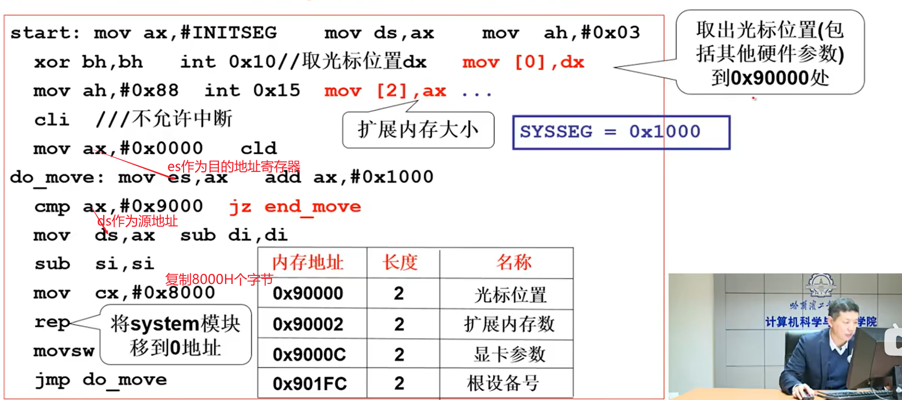
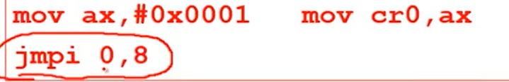
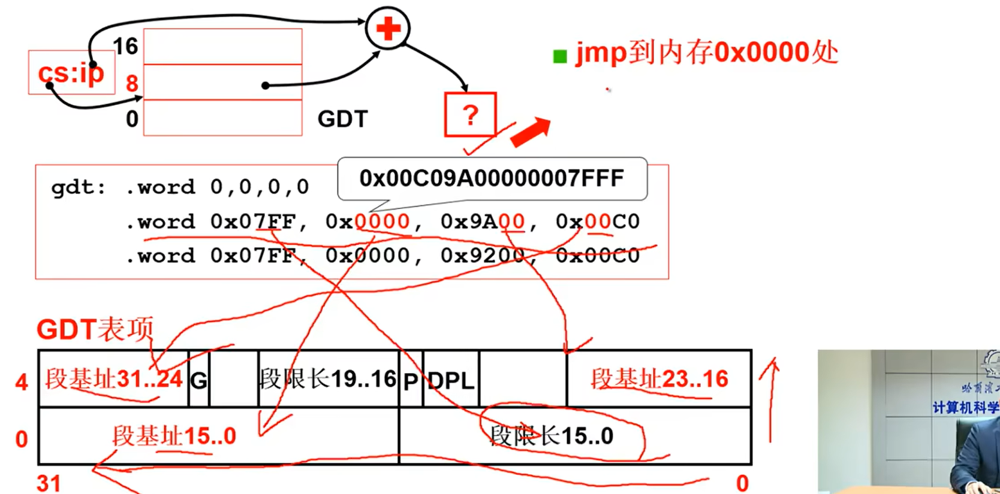

#读取第一段程序

X86 PC刚开机时CPU处于实模式，开机时CS = 0XFFFF， IP = 0X0000，接着寻址0XFFFF0(ROM BIOS映射区（通过地址总线寻找rom的内容）)。检查RAM等硬件，将磁盘的0磁道0扇区读入0X7C00处（512字节），设置CS = 0X07C0， IP = 0X0000。

#引导扇区代码（bootsect.s）

bootsect最后的操作是将system传输到内存中，起始地址为0x10000，传输完成后，将cs的值置为0x92000，将控制权交给setup。

#setup模块

计算机的寻址模式由cr0的最后一位控制，最后一位为0则是实模式，为1则是保护模式。

#进入保护模式

setup会构建,GDT表。cs代表表的偏移量。进入保护模式，扩大寻址范围。

#head.s

初始化页表，GDT表，跳转到main函数。main函数接着初始化一系列参数。

